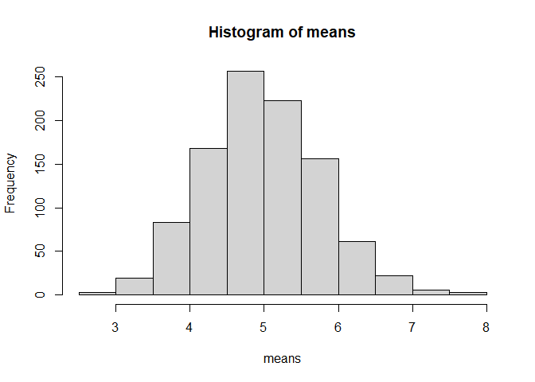
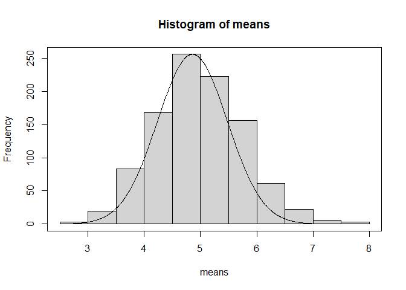

## Overview

The goal of this simulation is to compare 

## Simulation

```r
##Loading Library
library(ggplot2)
library(plotrix)
#Constant Variables
lambda <- 0.2
NumExp <- 40
set.seed(78)

tMean <- 1/lambda
tVar <- (1/lambda)^2/40

means <- c()
for(i in 1:1000){
    means[length(means) + 1] <- (mean(rexp(40, 0.2)))
}
hist(means)
```

<!-- -->

## Sample Mean vs Theoretical Mean


```r
#Sample Mean
sMean <- mean(means)
print(sMean)
```

```
## [1] 4.973703
```

```r
#Theoretical Mean
print(tMean)
```

```
## [1] 5
```

```r
t.test(means)$conf.int
```

```
## [1] 4.924850 5.022557
## attr(,"conf.level")
## [1] 0.95
```

As can clearly be seen the sample and theoretical 

## Sample Variance vs Theoretical Variance

```r
#Sample Variance
sVar <- var(means)
print(sVar)
```

```
## [1] 0.6197966
```

```r
#Theoretical Variance
print(tVar)
```

```
## [1] 0.625
```

##Normal Distribution

```r
#Creating Normal Distribution
x <- seq(2, 9, length = 1000)
y <- dnorm(x, mean = 5, sd = sqrt(0.625))

hist(means)
par(new = TRUE)
plot(x = x, y = y, xaxt = "n", yaxt = "n", type = "l", xlab ="", ylab ="")
```

<!-- -->
